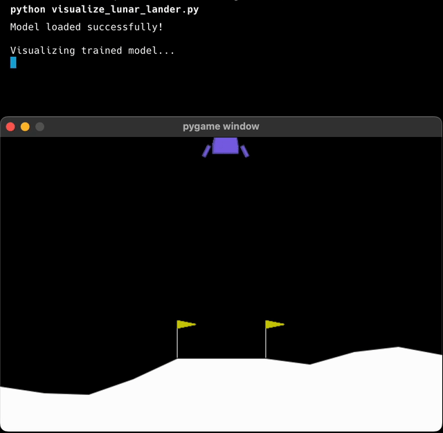

# Reinforcement Learning Experiments

A collection of reinforcement learning implementations using various algorithms and environments.

## Current Implementations

### Lunar Lander



PPO-based agent for the Lunar Lander environment. The agent learns to control a spacecraft's thrusters to achieve a safe landing while optimizing fuel consumption.

**Implementation Details:**
- Algorithm: Proximal Policy Optimization (PPO)
- Framework: PyTorch
- Environment: Gymnasium's LunarLander-v3
- Architecture: Actor-Critic with shared network layers

**Usage:**
```bash
# Install dependencies
pip install -r requirements.txt

# Train the model
python lunar_lander_ppo.py

# Visualize the trained model
python visualize_lunar_lander.py
```

**Technical Features:**
- Reward normalization
- Generalized Advantage Estimation (GAE)
- Policy clipping
- Value function approximation
- Entropy regularization

## License

MIT License 